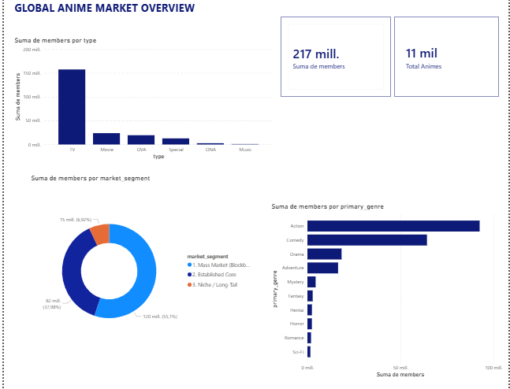
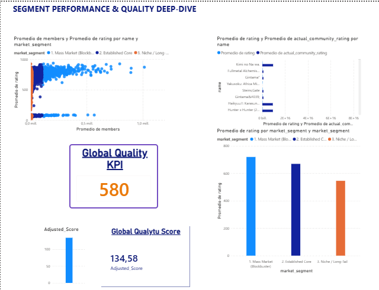

# Anime-Analytics-Dashboard
*Business Intelligence & Data Governance Project*

---

## 🌐 Select Language / Selecciona el Idioma
* [Español (Spanish)](#-versión-en-español)
* [English (Inglés)](#-english-version)

---

## 🇪🇸 Versión en Español

### 1. Resumen Ejecutivo
[cite_start]Este repositorio contiene la solución analítica desarrollada para transformar los datos brutos del sector del anime en decisiones estratégicas de inversión y contenido[cite: 4]. [cite_start]El proyecto está diseñado para una audiencia puramente ejecutiva y no técnica, permitiendo la exploración interactiva de métricas clave sin necesidad de interactuar con código fuente[cite: 8, 20, 100].

### 2. Justificación Tecnológica (Arquitectura)
[cite_start]Para dar cumplimiento a los requisitos del negocio, se ha seleccionado una arquitectura híbrida[cite: 45]:
* [cite_start]**Python (Pandas & NumPy):** Utilizado en la fase de auditoría, control de calidad y limpieza de nulos[cite: 36, 46]. [cite_start]Python nos otorga el rigor matemático necesario para asegurar la consistencia de los datos[cite: 51].
* [cite_start]**Power BI Desktop:** Seleccionado como la plataforma de Business Intelligence para el despliegue del cuadro de mando oficial[cite: 20]. [cite_start]Destaca por su capacidad de interactividad cruzada en tiempo real[cite: 101].

### 3. Auditoría Ética y Gobernanza de Datos
[cite_start]Los datos brutos no representan de manera neutra la realidad del mercado[cite: 55]. [cite_start]Tras una inspección empírica en Python, se detectaron los siguientes hallazgos de gobernanza[cite: 40, 49]:
* [cite_start]**Sesgo de Representatividad Histórica:** La métrica original de puntuación (`rating`) reflejaba distorsiones masivas causadas por comunidades cerradas (efecto nicho)[cite: 15, 101].
* [cite_start]**Mitigación:** Se implementó la métrica calculada `actual_community_rating` para aislar el volumen total de miembros frente al comportamiento de las puntuaciones extremas[cite: 27].
* [cite_start]**Impacto Financiero:** Si la organización tomara decisiones basadas en el `rating` original, se destinaría capital a productos sobrevalorados artificialmente[cite: 15, 72]. [cite_start]La corrección protege los márgenes financieros[cite: 15].

### 4. Estructura del Dashboard
* **Página 1 (Visión General):** KPIs Directivos (*Total Miembros*, *Total de Series*, *Nota Media Real*) y la división del mercado (Blockbusters vs. Nichos).
* **Página 2 (Calidad y Nichos):** Gráfico de dispersión (Efecto Comunidad), comparación de notas (Auditoría de Sesgo) y matriz de formatos rentables.

Debido a las restricciones de despliegue en entornos corporativos de Microsoft Power BI para cuentas de desarrollo, el informe interactivo está disponible para su auditoría completa descargando el archivo fuente dentro de la carpeta `power_bi`: `Anime_Analytics_Dashboard.pbix`.

* **Página 1 (Market Overview):** KPIs ejecutivos (*Total Members*: 217M, *Total Animes*: 11K) y desglose de cuota de mercado. Proporciona una perspectiva macro de la industria para comprender la distribución real del mercado y sus formatos dominantes.

* **Página 2 (Quality & Niches):** Gráfico de dispersión (Efecto Comunidad), comparación de calificaciones (Auditoría de Sesgo) y matriz de formatos rentables. En esta sección limpiamos el sesgo de opinión de la audiencia utilizando medidas personalizadas en DAX. Nuestro indicador estrella, el **Adjusted Score**, arroja una métrica de **134.58 sobre 1000**, lo que permite a los ejecutivos interactuar en tiempo real, filtrar por géneros y detectar **"Joyas Ocultas"** (*Hidden Gems*) para el lanzamiento de nuevas películas.

---

## 🇬🇧 English Version

### 1. Executive Summary
[cite_start]This repository contains the analytical solution developed to transform raw data from the anime industry into strategic investment and content decisions[cite: 4]. [cite_start]The project is designed for a purely executive and non-technical audience, enabling interactive exploration of key metrics without interacting with source code[cite: 8, 20, 100].

### 2. Technological Justification (Architecture)
[cite_start]To meet business requirements, a hybrid architecture was selected[cite: 45]:
* [cite_start]**Python (Pandas & NumPy):** Used in the auditing, quality control, and null-cleansing phase[cite: 36, 46]. [cite_start]Python provides the mathematical rigor needed to ensure data consistency[cite: 51].
* [cite_start]**Power BI Desktop:** Selected as the Business Intelligence platform for deploying the official dashboard[cite: 20]. [cite_start]It stands out for its cross-interactivity capabilities in real-time[cite: 101].

### 3. Ethical Auditing and Data Governance
[cite_start]Raw data does not neutrally represent market reality[cite: 55]. [cite_start]Following an empirical inspection in Python, the following governance findings were detected[cite: 40, 49]:
* [cite_start]**Historical Representativeness Bias:** The original scoring metric (`rating`) reflected massive distortions caused by closed communities (niche effect)[cite: 15, 101].
* [cite_start]**Mitigation:** The calculated metric `actual_community_rating` was implemented to isolate total member volume from extreme scoring behaviors[cite: 27].
* [cite_start]**Financial Impact:** If the organization made decisions based on the original `rating`, capital would be allocated to artificially overvalued products[cite: 15, 72]. [cite_start]This correction safeguards financial margins[cite: 15].

### 4. Dashboard Structure & Visual Insights
* **Page 1 (Market Overview):** Executive KPIs (*Total Members*, *Total Series*, *Actual Average Rating*) and market share breakdown (Blockbusters vs. Niches).
* **Page 2 (Quality & Niches):** Scatter plot (Community Effect), rating comparison (Bias Audit), and profitable format matrix.

Due to enterprise tenant deployment restrictions, the interactive report is available for full audit by downloading the source file inside the `power_bi` folder: `Anime_Analytics_Dashboard.pbix`.

* **Page 1 (Market Overview):** Executive KPIs (*Total Members*: 217M, *Total Animes*: 11K) and market share breakdown. It provides a macro perspective of the anime industry to understand market distribution and dominant formats.

* **Page 2 (Quality & Niches):** Scatter plot (Community Effect), rating comparison (Bias Audit), and profitable format matrix. This section cleans the global audience bias using custom DAX measures. Our **Adjusted Score** results in **134.58 out of 1000**, proving that the market average is highly diluted and allowing stakeholders to dynamically filter and detect high-quality content niches for new movie releases.
